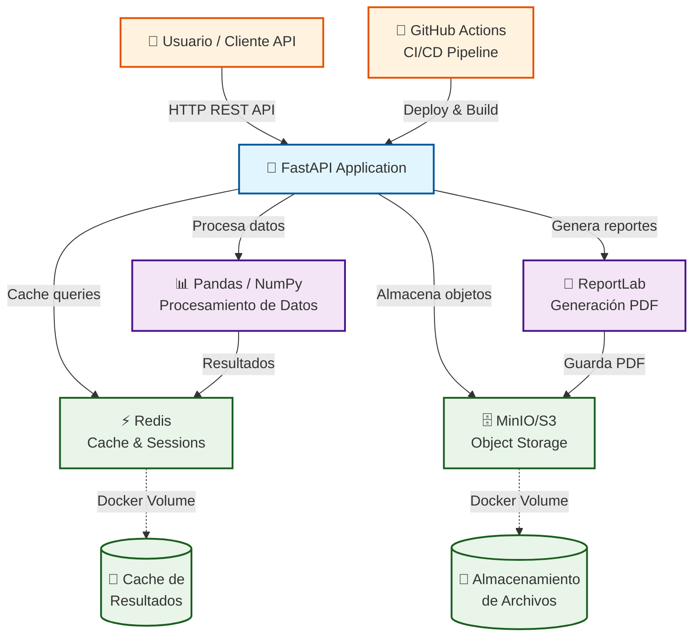

```mermaid
graph TD
    User[👤 Usuario / Cliente API]
    FastAPI[🚀 FastAPI Application]
    Pandas[📊 Pandas / NumPy<br/>Procesamiento de Datos]
    MinIO[🗄️ MinIO/S3<br/>Object Storage]
    Redis[⚡ Redis<br/>Cache & Sessions]
    PDF[📄 ReportLab<br/>Generación PDF]
    Storage[(💾 Almacenamiento<br/>de Archivos)]
    Cache[(🔄 Cache de<br/>Resultados)]
    GitHub[🔧 GitHub Actions<br/>CI/CD Pipeline]

    %% Conexiones principales
    User -->|HTTP REST API| FastAPI
    FastAPI -->|Procesa datos| Pandas
    FastAPI -->|Almacena objetos| MinIO
    FastAPI -->|Cache queries| Redis
    FastAPI -->|Genera reportes| PDF

    %% Infraestructura
    MinIO -.->|Docker Volume| Storage
    Redis -.->|Docker Volume| Cache
    GitHub -->|Deploy & Build| FastAPI

    %% Flujos de datos
    PDF -->|Guarda PDF| MinIO
    Pandas -->|Resultados| Redis

    %% Estilos
    classDef apiStyle fill:#e1f5fe,stroke:#01579b,stroke-width:2px
    classDef dataStyle fill:#f3e5f5,stroke:#4a148c,stroke-width:2px
    classDef storageStyle fill:#e8f5e8,stroke:#1b5e20,stroke-width:2px
    classDef infraStyle fill:#fff3e0,stroke:#e65100,stroke-width:2px

    class FastAPI apiStyle
    class Pandas,PDF dataStyle
    class MinIO,Redis,Storage,Cache storageStyle
    class GitHub,User infraStyle
```
