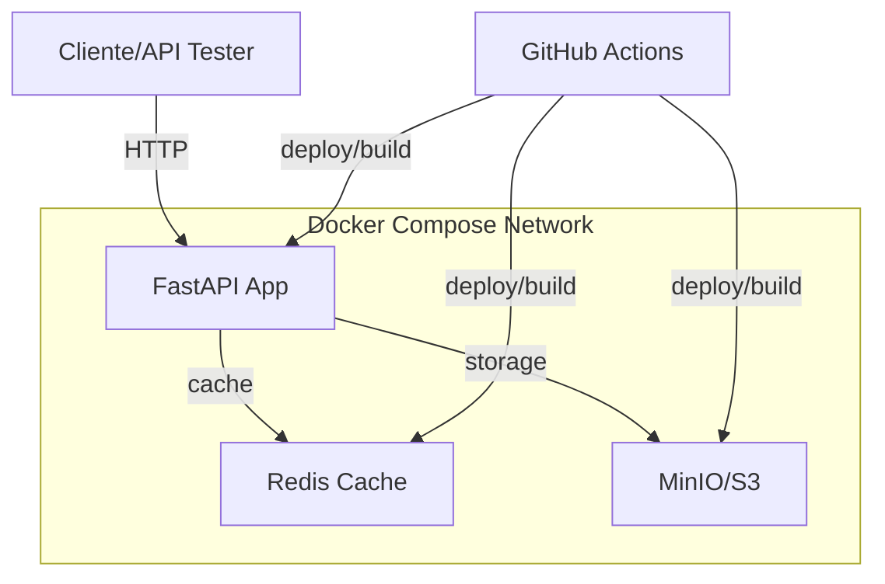

```mermaid
flowchart TD
    subgraph app["Docker Compose Network"]
        A[FastAPI App]
        B[Redis Cache]
        C[MinIO/S3]
    end

    D[Cliente/API Tester]
    E[GitHub Actions]

    D -->|HTTP| A
    A -->|cache| B
    A -->|storage| C
    E -->|deploy/build| A
    E -->|deploy/build| B
    E -->|deploy/build| C
```
