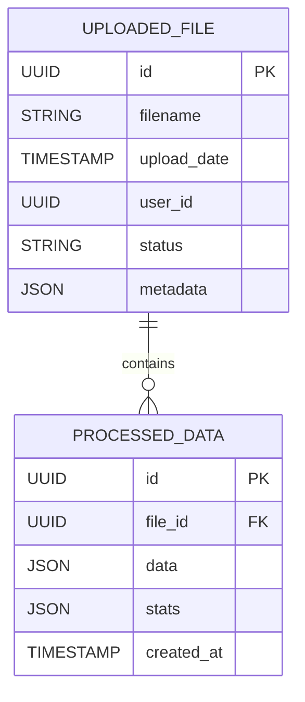

```mermaid
erDiagram
    "UPLOADED_FILE" {
        UUID id PK
        STRING filename
        TIMESTAMP upload_date
        UUID user_id
        STRING status
        JSON metadata
    }
    "PROCESSED_DATA" {
        UUID id PK
        UUID file_id FK
        JSON data
        JSON stats
        TIMESTAMP created_at
    }
    "UPLOADED_FILE" ||--o{ "PROCESSED_DATA" : contains
```
