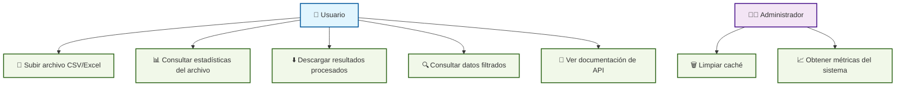

```mermaid
graph TD
    User[👤 Usuario]
    Admin[👨‍💼 Administrador]

    UC1["📁 Subir archivo CSV/Excel"]
    UC2["📊 Consultar estadísticas del archivo"]
    UC3["⬇️ Descargar resultados procesados"]
    UC4["🔍 Consultar datos filtrados"]
    UC5["📖 Ver documentación de API"]
    UC6["🗑️ Limpiar caché"]
    UC7["📈 Obtener métricas del sistema"]
    
    User --> UC1
    User --> UC2
    User --> UC3
    User --> UC4
    User --> UC5
    
    Admin --> UC6
    Admin --> UC7
    
    classDef userClass fill:#e1f5fe,stroke:#01579b,stroke-width:2px
    classDef adminClass fill:#f3e5f5,stroke:#4a148c,stroke-width:2px
    classDef useCaseClass fill:#f1f8e9,stroke:#33691e,stroke-width:2px
    
    class User userClass
    class Admin adminClass
    class UC1,UC2,UC3,UC4,UC5,UC6,UC7 useCaseClass
```
