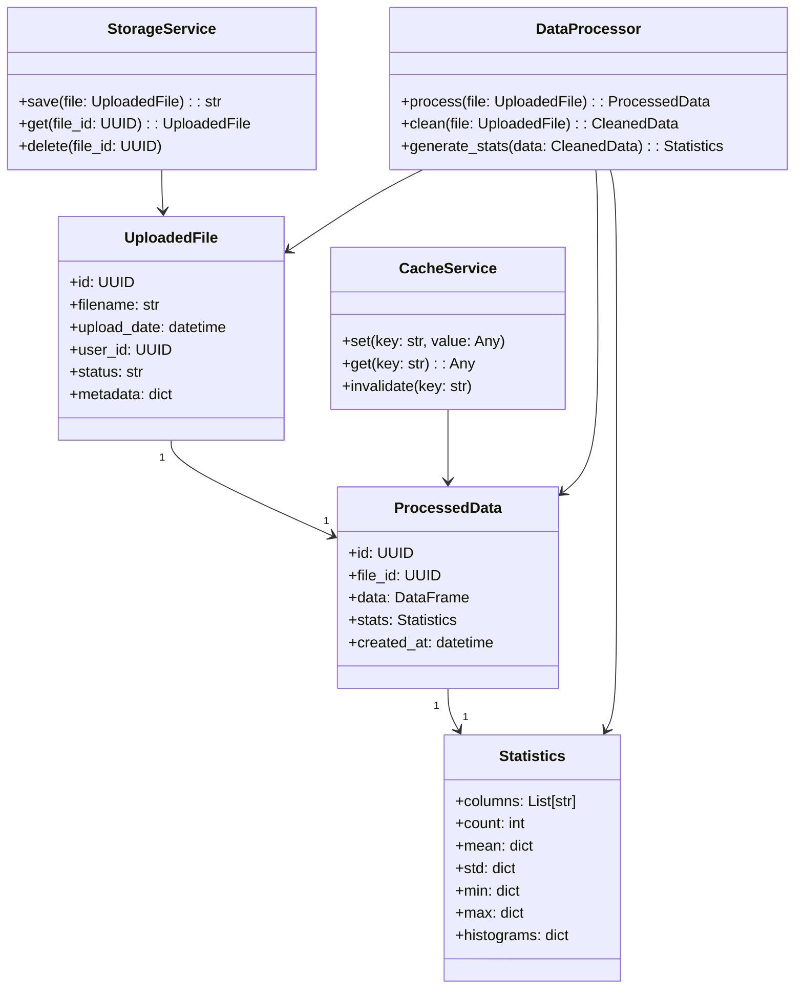

```mermaid
classDiagram
    class UploadedFile {
        +id: UUID
        +filename: str
        +upload_date: datetime
        +user_id: UUID
        +status: str
        +metadata: dict
    }

    class DataProcessor {
        +process(file: UploadedFile): ProcessedData
        +clean(file: UploadedFile): CleanedData
        +generate_stats(data: CleanedData): Statistics
    }

    class ProcessedData {
        +id: UUID
        +file_id: UUID
        +data: DataFrame
        +stats: Statistics
        +created_at: datetime
    }

    class Statistics {
        +columns: List[str]
        +count: int
        +mean: dict
        +std: dict
        +min: dict
        +max: dict
        +histograms: dict
    }

    class StorageService {
        +save(file: UploadedFile): str
        +get(file_id: UUID): UploadedFile
        +delete(file_id: UUID)
    }

    class CacheService {
        +set(key: str, value: Any)
        +get(key: str): Any
        +invalidate(key: str)
    }

    UploadedFile "1" --> "1" ProcessedData
    ProcessedData "1" --> "1" Statistics
    DataProcessor --> UploadedFile
    DataProcessor --> ProcessedData
    DataProcessor --> Statistics
    StorageService --> UploadedFile
    CacheService --> ProcessedData
```
