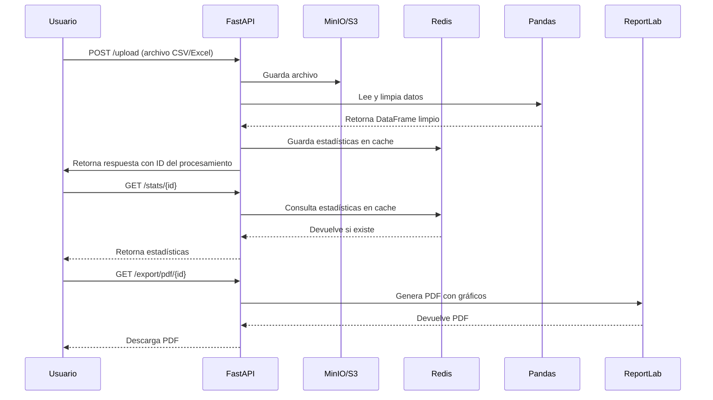

```mermaid
sequenceDiagram
    participant User as Usuario
    participant API as FastAPI
    participant MinIO as MinIO/S3
    participant Redis as Redis
    participant Pandas as Pandas
    participant PDF as ReportLab

    User->>API: POST /upload (archivo CSV/Excel)
    API->>MinIO: Guarda archivo
    API->>Pandas: Lee y limpia datos
    Pandas-->>API: Retorna DataFrame limpio
    API->>Redis: Guarda estadísticas en cache
    API->>User: Retorna respuesta con ID del procesamiento

    User->>API: GET /stats/{id}
    API->>Redis: Consulta estadísticas en cache
    Redis-->>API: Devuelve si existe
    API-->>User: Retorna estadísticas

    User->>API: GET /export/pdf/{id}
    API->>PDF: Genera PDF con gráficos
    PDF-->>API: Devuelve PDF
    API-->>User: Descarga PDF
```
